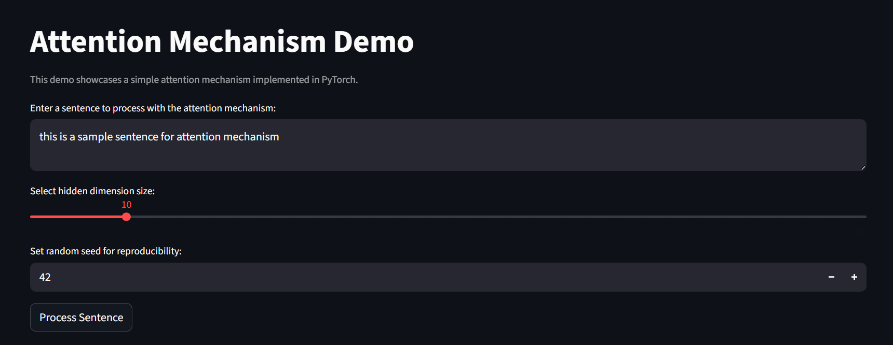
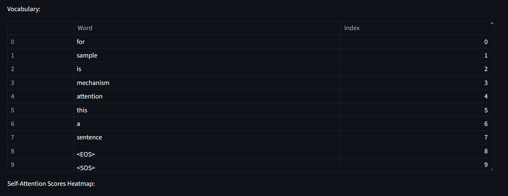
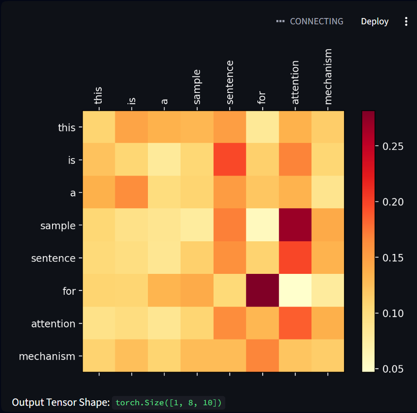

# Attention Mechanism Demo (PyTorch + Streamlit)

This project is a minimal interactive demo of a self-attention mechanism implemented in PyTorch and visualized with Streamlit.



The core components are:

- `attention.py`: Defines a simple self-attention layer (`Attention`) and a toy tokenizer (`SampleTokenizer`).
- `main.py`: Streamlit app that lets you type a sentence, runs it through the attention layer, and visualizes attention scores and intermediate tensors.

## Setup

1. **Clone or copy** this repository into a local folder.
2. (Optional but recommended) **Create and activate a virtual environment**:

   ```bash
   python -m venv venv
   # Windows (PowerShell)
   venv\\Scripts\\Activate.ps1
   # or Windows (cmd)
   venv\\Scripts\\activate.bat
   ```

3. **Install dependencies**:

   ```bash
   pip install -r requirements.txt
   ```

## Running the app

From the project root (`Attention/`), run:

```bash
streamlit run main.py
```

Then open the URL shown in the terminal (usually `http://localhost:8501`).

## Demo Screenshots

### Vocabulary Table

The tokenizer builds a vocabulary from your input sentence:



### Attention Heatmap

Visualize the self-attention scores between tokens:



## Files overview

- `attention.py`
  - `Attention`: simple scaled dot-product self-attention layer using PyTorch.
  - `SampleTokenizer`: toy tokenizer that builds a vocabulary from a sentence and creates an embedding tensor.
- `main.py`
  - Streamlit UI for entering a sentence, selecting hidden size, and visualizing:
    - vocabulary
    - attention score heatmap
    - query/key/value tensors

## Notes

- The model and tokenizer are intentionally simple and meant for educational/visualization purposes, not for production use.
- If you have GPU support and an appropriate PyTorch build installed, PyTorch will automatically use CUDA when tensors are moved to GPU; this demo currently runs on CPU tensors by default.
